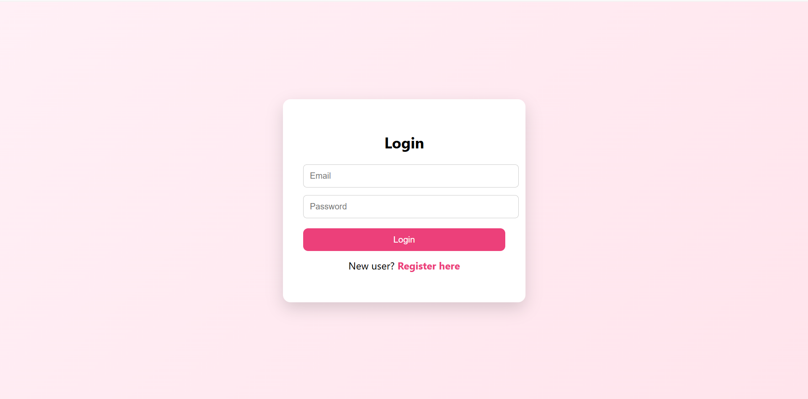
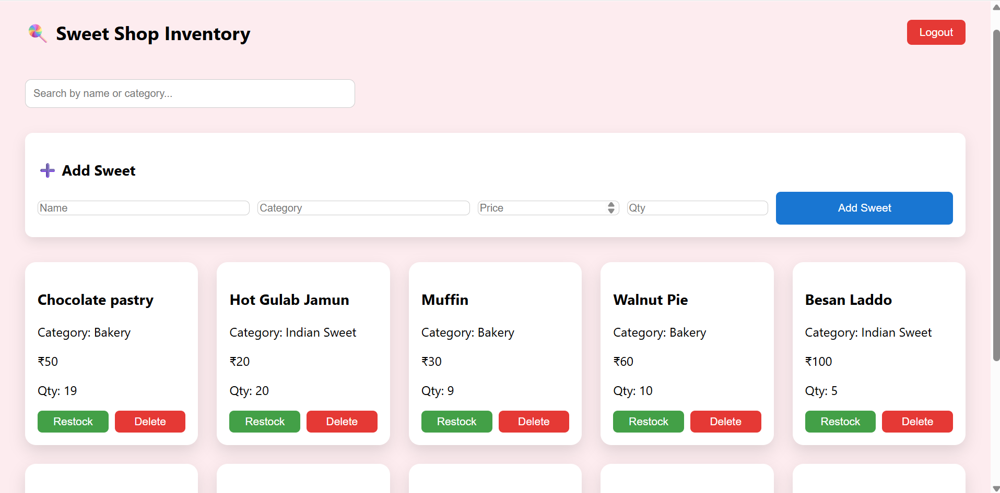
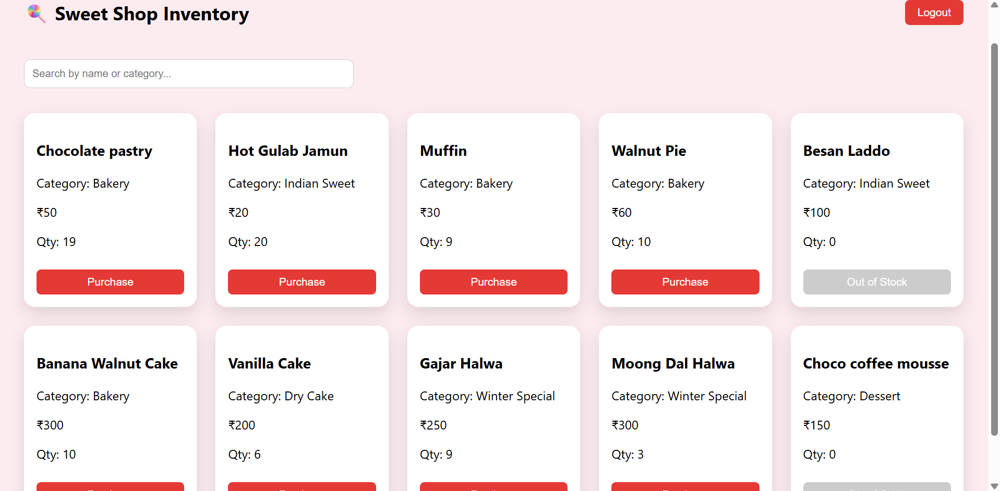

🍭 **Sweet Shop Management System**
A full-stack Sweet Shop Management System built using FastAPI (backend) and React + Vite (frontend).
This project supports user authentication, role-based access control (admin/user), and inventory management for sweets.

**Features**

**Authentication & Authorization**
  User registration & login
  JWT-based authentication
  Role-based access:
  Admin: Add, restock, delete sweets
  User: View sweets inventory

**Sweet Inventory Management**
  View all sweets
  Search & filter sweets
  Purchase sweets
  Admin-only:
  Add new sweets
  Restock sweets
  Delete sweets

**Frontend UI**
  Login page (shown first)
  Protected routes
  Admin controls visible only to admins
  Clean UI with soft pastel styling

🛠️ **Tech Stack**
**Backend**
  FastAPI
  SQLAlchemy
  SQLite
  JWT Authentication
  Passlib (bcrypt)

**Frontend**
  React
  Vite
  React Router
  Fetch API

📁 Project Structure
Sweet_Shop_backend/
│
├── main.py
├── database.py
├── models.py
├── schemas.py
├── auth.py
├── security.py
├── permissions.py
│
├── Sweet_Shop_frontend/
│   ├── src/
│   │   ├── pages/Login.jsx
│   │   ├── Sweets.jsx
│   │   ├── App.jsx
│   │   └── index.css
│   └── package.json
│
└── README.md

🚀 **How to Run the Project**
**Backend Setup (FastAPI)**
cd Sweet_Shop_backend
python -m venv venv
venv\Scripts\activate
pip install -r requirements.txt
uvicorn main:app --reload

Backend will run at:
http://127.0.0.1:8000

Swagger UI:
http://127.0.0.1:8000/docs

**Frontend Setup (React + Vite)**
cd Sweet_Shop_backend/Sweet_Shop_frontend
npm install
npm run dev

Frontend will run at:
http://localhost:5173

**Admin Login :**
  Username : admin@example.com
  Password : admin123
**Normal User Login :**
  Username : user@example.com
  Password : user123

**Authentication Flow**
App opens on Login page
On successful login:
JWT token stored in localStorage
User redirected to /sweets
Logout clears token and redirects to login
Protected routes block unauthenticated users

**Admin Access**
To make a user an admin:
Update the user's role in the database to "admin"
Admins can:
  Delete sweets
  Restock sweets
  See admin-only buttons in UI

**AI Usage**
**AI Tools Used**

ChatGPT (OpenAI)

**How I Used AI**

I used ChatGPT as a coding assistant and learning aid during the development of this project. Specifically:
To understand the problem statement and requirements
To brainstorm API endpoint designs and backend architecture using FastAPI
To generate initial boilerplate code for:
  FastAPI routes
  SQLAlchemy models
  JWT-based authentication
  
To debug errors related to:
  Authentication
  Token handling
  React routing and state issues

To get explanations of concepts such as:
  Role-based access control
  Protected routes in React
  JWT authentication flow

**Reflection on AI Impact**

AI significantly improved my development speed and learning efficiency.
Instead of copying solutions blindly, I used AI to:
Understand why certain patterns are used
Fix bugs by reasoning through errors
Refactor code based on best practices
All final code decisions, integrations, testing and debugging were performed and validated.

**Test Report**

The application was tested manually using Swagger UI and the React frontend.

**Backend API Testing (Swagger)**

✅ User registration

✅ User login (JWT token generation)

✅ Protected endpoints blocked without token

✅ Admin-only endpoints restricted properly

✅ Sweet creation, deletion, restocking (admin)

✅ Sweet listing and viewing (user)

**Frontend Testing**

✅ Login page loads by default

✅ Invalid credentials are rejected

✅ Successful login redirects to sweets page

✅ JWT token stored in localStorage

✅ Logout clears token and redirects to login

✅ Admin UI buttons visible only for admin users

✅ Normal users cannot see admin actions

**Final Application Screenshots**

